# Overview

The goal of this project is to improve the fidelity and reduce empty areas in point clouds generated from Microsoft Kinect RGB-D data. A secondary goal is to remove human figures from the scene to remain with complete room geometry from single-view RGB-D data.

# Background

Point clouds are ubiquitously used in the computer vision, machine learning, and augmented reality fields to represent 3D data. One common way to generate point clouds is to take RGB and depth video from a Microsoft Kinect. By combining these two feeds, one can create a textured point cloud of the recorded scene.

A drawback of using single-view RGB-D data to form point clouds is that many holes exist in the generated cloud. Any area that is not directly visible to the depth camera with have no points in the point cloud. When capturing indoor room scenes, occlusion from furniture or human figures is prevalent and severely detracts from the final cloud.

# Purpose and Goals

Point clouds have several applications in augmented reality. They can be used to detect planes and surfaces for valid AR market placement and ensure accurate occlusion of augmented figures in a scene. Many machine learning algorithms take in point clouds as input, and some surface reconstruction algorithms output point clouds that can be processed further.

Therefore, it is important to have point clouds closely represent the source environment to produce the most accurate results after further processing. The primary application of this project is to clean and refine raw point clouds generated from Kinect data, which can then be used as inputs to other algorithms for semantic segmentation or reconstruction. However, it can be used to refine any point clouds supplied as a pre- or post-processing step.

# Data

The data used for this project is the [IKEA Assembly Dataset](https://ikeaasm.github.io/), which provides multi-view videos of humans assembling various IKEA furniture in several environments. They also provide ground truth annotations for semantic segmentation, human pose estimation, and assembly steps, although for this project we will only use a single-view RGB and depth stream.

The dataset also includes code to generate point clouds from the Kinect data. Other libraries and methods exists to create these point clouds, although we use the code included with the dataset. Our method can easily be tweaked to take RGB-D data and camera parameters as input and generate the point clouds within the program, but we chose to accept point clouds as input as this is intended to be a preprocessing step in larger pipelines.

The figure below shows an example RGB and depth image as captured from the Kinect, as well as the point cloud created from fusing the two images.

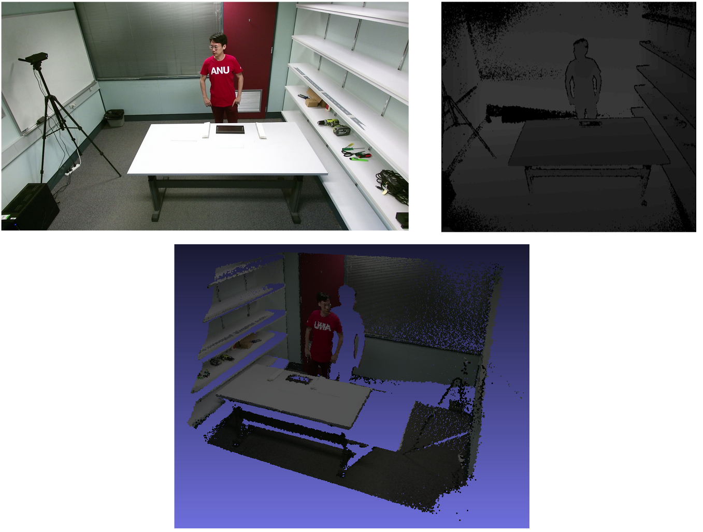
_Top: RGB and depth image from dataset_

_Bottom: Generated point cloud_

# Implementation

## Technical Details

This project is implemented in Python3 using the [Open3D](http://www.open3d.org/) library.

## Process

The point cloud refinement process involves several transformations from mesh to point cloud using varying algorithms. During each transformation, we lose irrelvant information or gain information in missing places. Between transformations, we refine the representation of the environment and perform the necessary calculations required for the next step.

_Point cloud processing flow_

### Clean Point Cloud

The data taken from the Kinect is often noisy, which results in poor quality point clouds. We perform simple statistical analysis and remove outliers, shown in the middle image below in red. A point is determined to be an outlier if it is further away from its neighbors compared to the average for the point cloud. The end result is a clean point cloud that does not contain any stray points or inaccurate data.

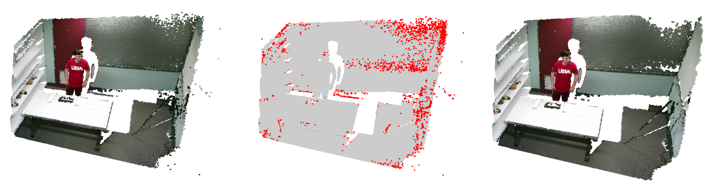
_Left: Original point cloud_

_Middle: Outliers (shown in red)_

_Right: Cleaned point cloud_

### Compute Surface Normals

In order for the meshing algorithms to work correctly, the point cloud must contain accurate surface normals. Open3D provides a function to estimate this, which considers each point and its neighbors, then fits a surface to those points and computes the normals. However, the estimation only considers the local neighbors of each point, which can introduce inconsistency among the normals of a point and the ones around it.

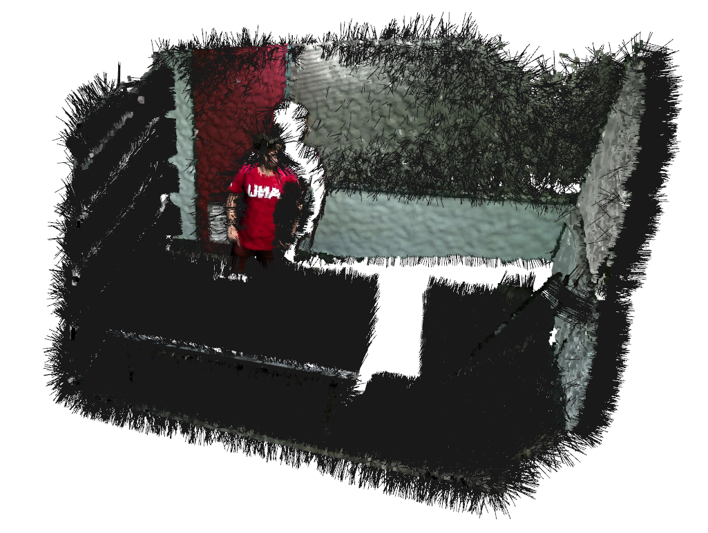
_Point cloud with estimated normals_

### Refine Surface Normals

While the previous step estimates the normals of each point, they are still not consistent enough to perform accurate meshing. As seen in the floor of the room pictured below, some point normals are facing up while others are facing the opposite direction. This affects the meshing algorithm as it will not interpret the floor as one continuous surface. To rectify this problem, we align the surface normals according to a consistent tangent plane. The end result is a point cloud with normals aligned consistently with one another.

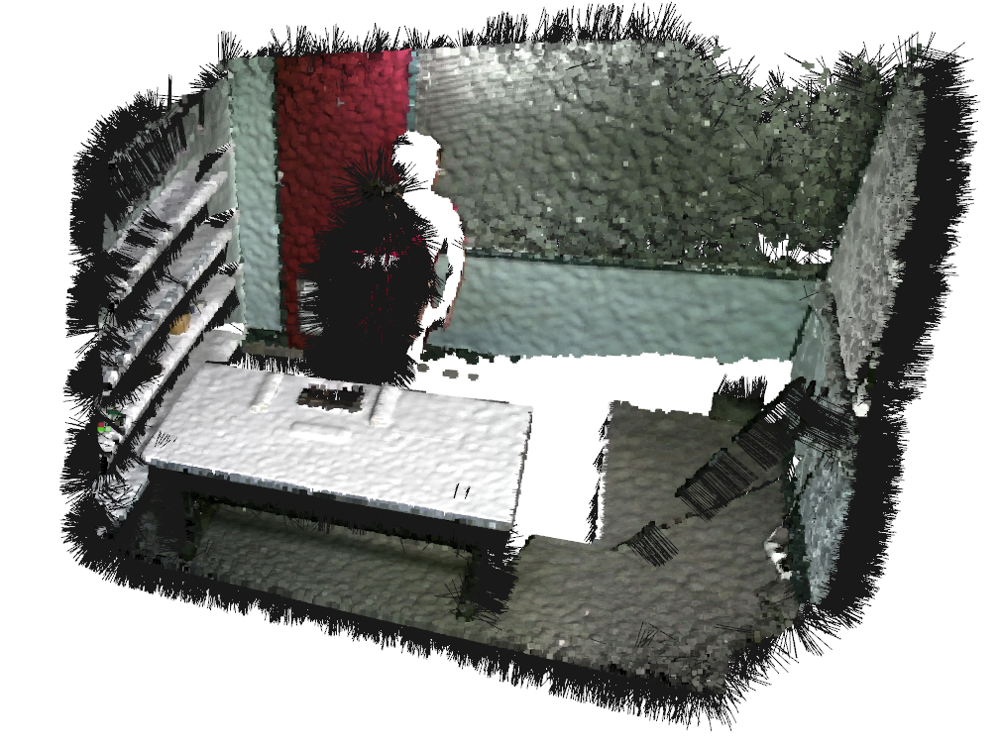
_Point cloud with refined normals_

### Mesh with Ball Pivoting Algorithm

The next step is to mesh the point cloud with our first algorithm, the ball pivoting algorithm (BPA). This method works by dropping imaginary spheres of varying radii into the point cloud. When a sphere touches 3 points, the algorithm connects them into a mesh face. The ball then rolls around the first face and creates new faces until eventually falling through the mesh. This is provided by Open3D.

This step reconstructs the planes within the point cloud very well, clearly extracting the walls, tables, and floor visible from the original point cloud. With correct parameter tuning, shown in the middle below, only the room geometry will remain in the mesh while the human figure is lost, as well as some partially captured objects that are not fully present in the original cloud. However, since the BPA only considers existing points while reconstructing surfaces, the large gaps present in the point cloud remain in the output mesh.

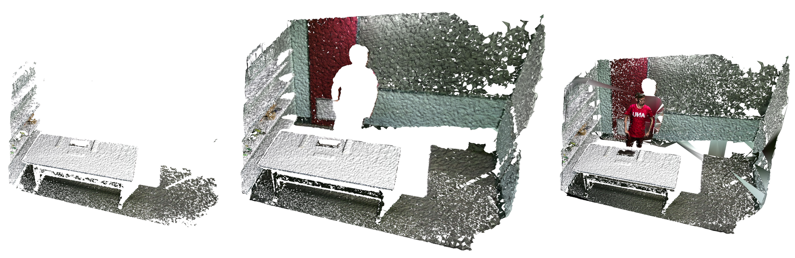
_Left: BPA mesh with sphere radii too small_

_Middle: BPA mesh with tuned sphere radii_

_Right: BPA mesh with sphere radii too large_

### Resample Point Cloud

In order to perform further meshing algorithms, we then sample the mesh produced in the previous step and create a new point cloud. We use Poisson Disk Sampling, chosen for its even sampling along the entire mesh surface. Compared to other sampling methods, Poisson Disk Sampling results in the least amount of point clustering in corners and provides a uniform point cloud.

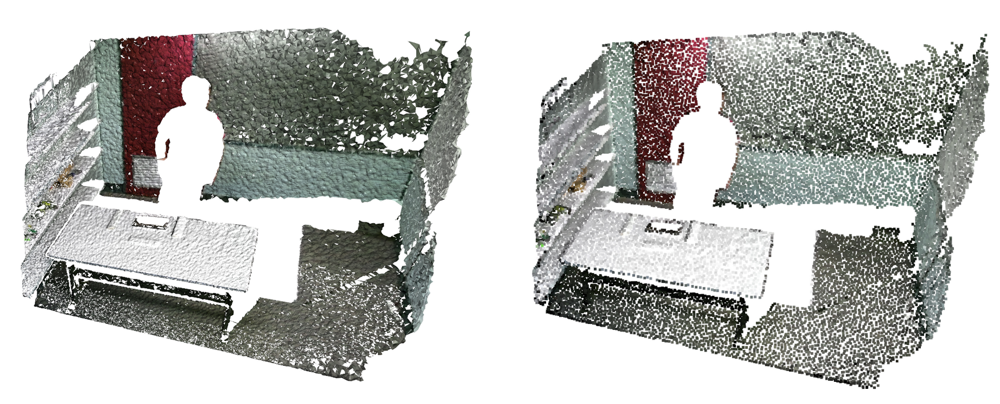
_Right: Mesh produced by BPA_

_Left: Point cloud sampled from mesh_

### Mesh with Poisson 

To fill in the holes remaining in the resampled point cloud, we mesh using Poisson Surface Reconstruction (PSR). This meshing algorithm solves an optimization problem among the points to fit a smooth surface over the geometry, akin to laying a blanket over the point cloud. Open3D provides an implementation of PSR. A larger depth parameter results in a tighter fit to the original points. For this application we use a depth of 16, as higher depth values resulted in long computation times or errors during initial seeding of the algorithm. 

This step fills in most of the gaps in the point cloud. Areas such as behind the human figure, behind the table, and underneath the shelves on the left wall are now smooth and continuous with the rest of the surface. Unfortunately, this step also extends the mesh past the original room boundary and can "swell" thin objects, as seen below in the shelves along the wall and the edges of the table.

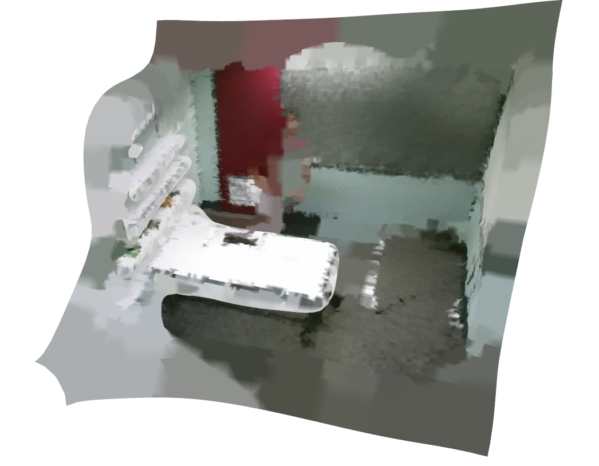
_Mesh Produced by PSR_

### Refine Poisson Mesh

During PSR, some mesh faces are created using many points close together, while others are created with few points spread apart. This results in dense and rare faces, visualized in the picture below to the left with dense faces colored yellow and slowly fading to purple as the density decreases. We can extract each face's density value from the PSR function call and use the values to remove faces below an arbitrary density threshold. We chose to remove faces with density values less than the 0.01th quantile of all density values present in the mesh. This results in the cropped mesh, shown below and to the right. While this method is not perfect, it removes some mesh faces past the boundary of the room. Unfortunately, it also removes faces covering large holes within the room, such as behind the table. These faces simply do not have enough points to ensure accuracy to the original room geometry.

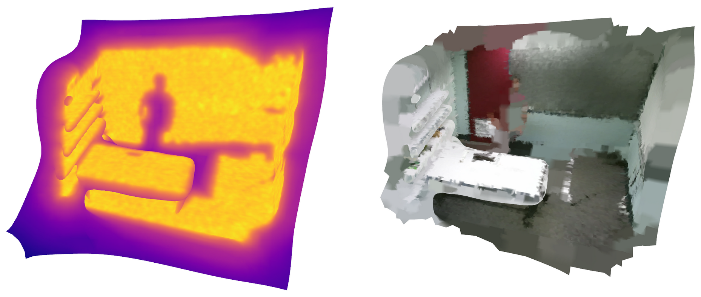
_Left: PSR Mesh Colored by Density_

_Right: Cropped PSR Mesh_

### Sample Final Point Cloud

Finally, we sample the final point cloud from the PSR mesh. We use Poisson Disk Sampling, as in the last sampling step. This yields the final point cloud, shown below. While the final point cloud contains less points than the input, it is still dense enough to operate on. The original point cloud is very dense in areas the camera can see and nonexistent where occluded. The final point cloud is evenly dense across all filled areas. Furthermore, since we sample from a continous mesh, if a denser point cloud is needed we can simply change the sampling parameter to include more points. The images shown below contain 35,000 points per cloud. 

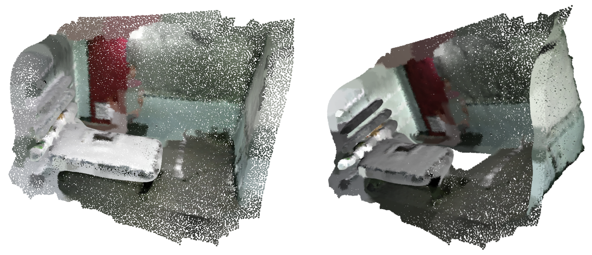
_Final point cloud_

# Results

The end result is a point cloud with most gaps filled when compared with the original. Areas that were moderately occluded from the depth camera have been filled in, such as behind the human figure in both scenes below. In Scene 1, missing areas behind and below the wall shelves have been filled, as well as some area behind the table. In Scene 2, the wall and corners behind the couch are filled, as well as some missing areas on the couch. The original point cloud for Scene 4 contains only 3 segments of the wall behind the human figure, while in our reconstructed version, the entire wall is filled in, as well as the holes below and behind the table. We noticed our method performs best on closed scenes where 3 walls are visible.

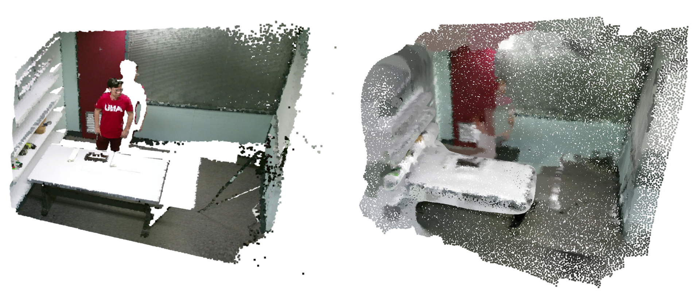
_Scene 1_

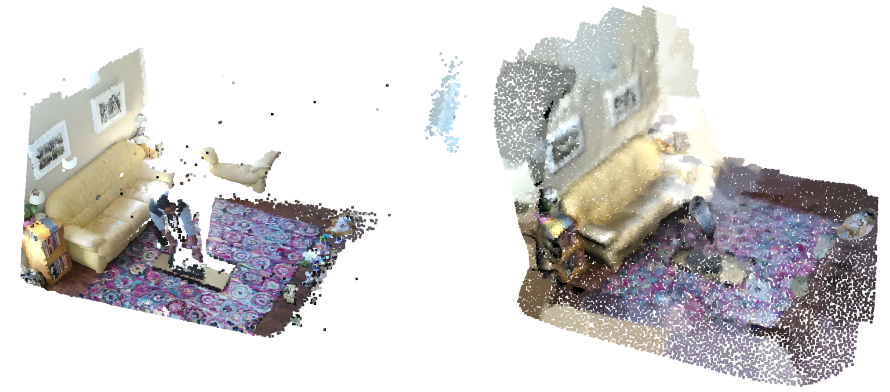
_Scene 2_

Unfortunately, this reconstruction is not perfectly accurate. Thin objects tend to swell during the PSR stage, and the final point cloud often extends beyond the original room boundary. We experimented with methods to reduce these inaccuracies but ultimately were unsuccessful. Additionally, we may lose some thin or partially captured objects, shown by the desks on the left side of Scene 3, and the green box on the left of Scene 4. These objects are not captured during the BPA stage due to the meshing parameters. With tuning of parameters, the objects could be retained, however this will adversely affect the algorithm's performance on other scenes. We opted to choose parameters that had the best general performance over all scenes as opposed to individual scene parameter tuning as the latter  does not scale.

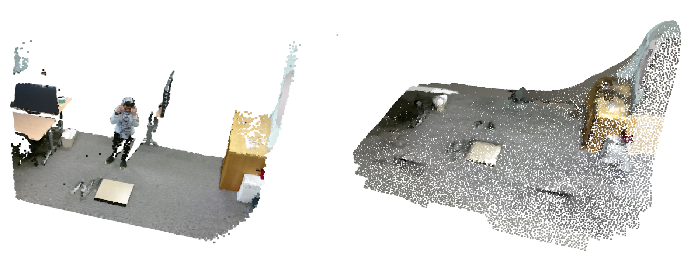
_Scene 3_

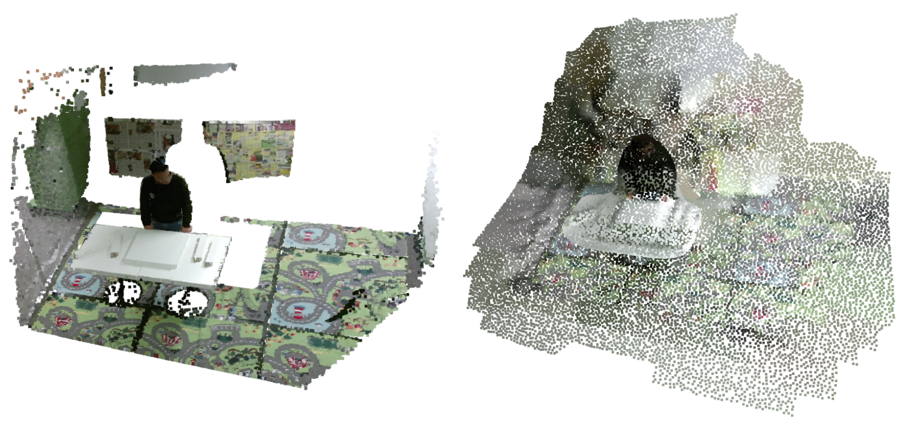
_Scene 4_

# Failed Experiments

Naturally, we explored several different methods before reaching our final solution. While some of these options show potential, we ran into issues that require more time and testing than available. Other methods simply did not perform as well.

## Bounding Box Cropping

To solve the issue of the final point cloud extending past the room boundary, we experimented with cropping the output according to a bounding box computed from the cleaned orignal point cloud. The idea is that since the cleaned point cloud matches the room boundary exactly, we can define a bounding box that tightly fits the walls of the room. We can then use that bounding box to crop the final point cloud and remove any points that extend outside the room. Unfortunately, we were unable to align the bounding box correctly with the room geometry, and therefore the box was not tightly fit enough to remove any points from the final point cloud.

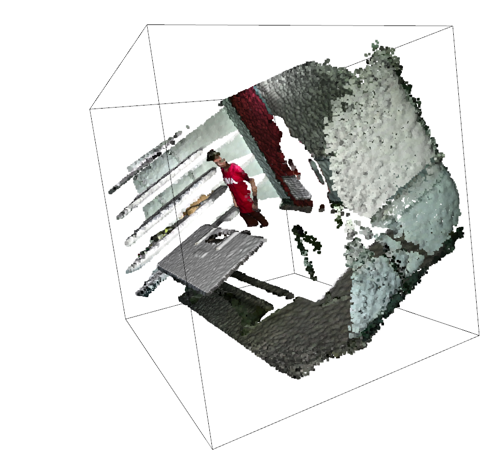
_Bounding box around original point cloud_

## Aggregating Original Point Clouds

The first idea we experimented with was simply aggregating point clouds from the same scene. Since the dataset provides videos of assembly, we wanted to use information from several frames temporally distant from each other to aggregate more information about the scene. Unfortunately, due to the single-view nature of the scene, we could only gain information where the human figure moved and any surfaces occluded by objects were not improved. Additionally, this method introduced more noise in the human figure and yielded poorer results.

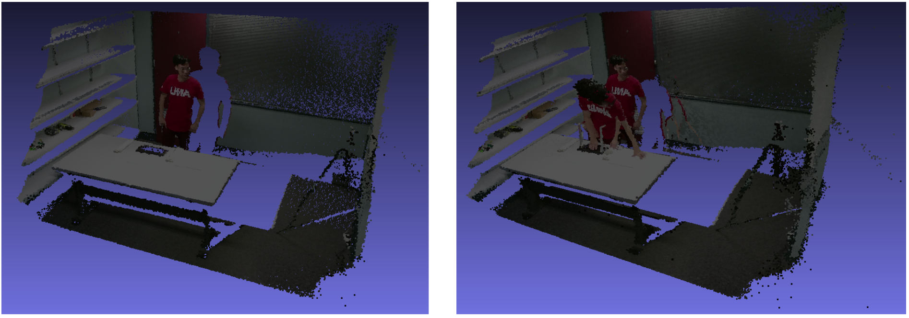
_Comparison of single and aggregated point cloud_

## Planar Estimation

Another method we tried involved planar estimation of the walls and floor. The idea is that if we can estimate the prevalent planes from the scene, we could then generate new points along that plane and add them to the point cloud. We could extract the points only in missing areas of the point cloud and fill major gaps without the swelling cuased by PSR. While we were able to identify major planes in the scene, shown below in green, we could not generate new points along that plane to add to the point cloud. However, this method shows potential and, if both are solved, could be combined with bounding box cropping to improve results.

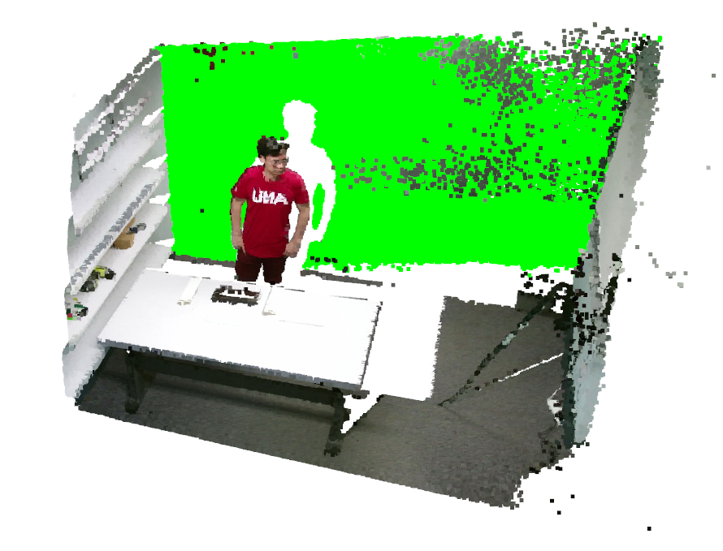

_Point cloud with identified plane_

# Discussion

While the dataset used contains assemblies from several different environments, we are unsure how our method generalizes to different data. Running our method on outdoor scenes, or scenes with multiple human figures included could yield insightful information.

We also noted that the performance of our method draws heavily from the accuracy of the second meshing stage. Employing other meshing algorithms, such as [REIN](https://openaccess.thecvf.com/content_CVPRW_2020/papers/w22/Daroya_REIN_Flexible_Mesh_Generation_From_Point_Clouds_CVPRW_2020_paper.pdf), a neural network based solution, could yield significantly better results. According to their paper, REIN performs much better than both BPA and PSR, which could extend to our data as well.

Considering partial neural network implementation in our method leads us to consider the viability of an end-to-end neural network implementation of our algorithm. A network could learn semantic information about objects in the scene, which can improve reconstruction accuracy on the backside of objects in the scene. For example, if the network sees only the front of a couch, it could recognize how the backside typically looks and reconstruct the points in the same manner. This method should be explored further.

Our method also could be used to generate different views of the scene. By filling in the rest of the environment, we could render the scene and generate new image data from a different vantage point. Mesh representations are more useful for this application, so we could modify the current process to skip the final point cloud sampling and output the PSR mesh for further processing.
