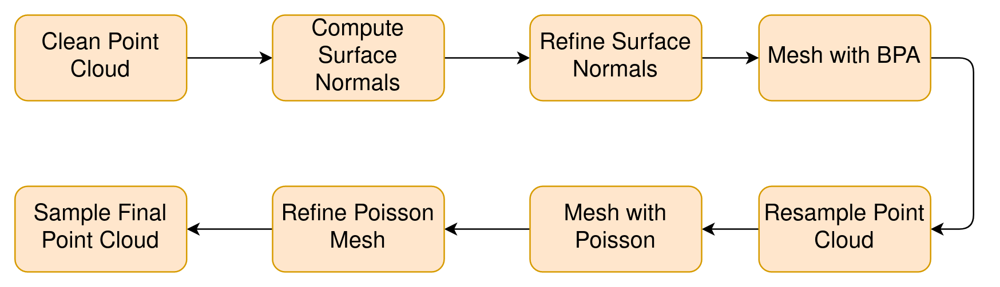

# Overview

The goal of this project is to improve the fidelity and reduce empty areas in point clouds generated from Microsoft Kinect RBG-D data. A secondary goal is to remove human figures from the scene to remain with complete room geometry from single-view RGB-D data.

# Background

Point clouds are ubiquitously used in the computer vision, machine learning, and augmented reality fields to represent 3D data. One common way to generate point clouds is to take RGB and depth video from a Microsoft Kinect. By combining these two feeds, one can create a textured point cloud of the recorded scene.

A drawback of using single-view RGB-D data to form point clouds is that many holes exist in the generated cloud. Any area that is not directly visible to the depth camera with have no points in the point cloud. As my focus for this project is indoor room scenes, occlusion from furniture or human figures is prevalent and severely detracts from the final cloud.

# Purpose and Goals

Point clouds have several applications in augmented reality. They can be used to detect planes and surfaces for valid AR market placement, as well as accurate occlusion of augmented figures in a scene. Many machine learning algorithms take in point clouds as input, and some surface reconstruction algorithms output point clouds that can be processed further.

Therefore, it is important to have point clouds closely represent the source environment to produce the most accurate results after further processing. The primary application of this project is to clean and refine raw point clouds generated from Kinect data, which can then be used as inputs to other algorithms for semantic segmentation or reconstruction. However, it can be used to refine any point clouds supplied as a pre- or post-processing step.

# Data

The data used for this project is the [IKEA Assembly Dataset](https://ikeaasm.github.io/), which provides multi-view videos of humans assembling various IKEA furniture in several environments. They also provide ground truth annotations for semantic segmentation, human pose estimation, and assembly steps, although for this project we will only use a single-view RBG and depth stream.

The dataset also includes code to generate point clouds from the Kinect data. Other libraries and methods exists to create these point clouds, although we use the code included with the dataset. Our method can easily be tweaked to take RGB-D data and camera parameters as input and generate the point clouds within the program, but we chose to accept point clouds as input as this is intended to be a preprocessing step in larger pipelines.

# Implementation

## Technical Details

This project is implemented in Python3 using the [Open3D](http://www.open3d.org/) library.

## Process

The point cloud refinement process involves several transformations from mesh to point cloud using various methods. During each transformation, we gain information in missing places or lose irrelvant information. Between transformations, we refine the representation of the environment and perform the necessary calculations for the next step.

_Point Cloud Preprocessing Flow_

### Clean Point Cloud

The data taken from the Kinect is often noisy, which results in poor quality point clouds. We perform simple statistical analysis and remove outliers. A point is determined to be an outlier if it is further away from its neighbors compared to the average for the point cloud. The end result is a clean point cloud that does not contain any stray points or inaccurate data.

### Compute Surface Normals

In order for the meshing algorithms to work correctly, the point cloud must contain accurate surface normals. Open3D provides a function to estimate this, which considers each point and its neighbors, then fits a surface to those points and computes the normals. However, the estimation only considers the local neighbors of each point, which can introduce inconsistency among the normals of a point and the ones around it.

### Refine Surface Normals

While the previous step estimates the normals of each point, they are still inconsistent enough to perform accurate meshing. As seen in the floor of the room pictured below, some point normals are facing up while others are facing the opposite direction. This affects the meshing algorithm as it will not interpret the floor as one continuous surface. To rectify this problem, we align the surface normals according to a consistent tangent plane. The end result is a point cloud with normals aligned consistently with one another.

### Mesh with Ball Pivoting Algorithm

The next step is to mesh the point cloud with our first algorithm, the ball pivoting algorithm (BPA). This method works by dropping imaginary spheres of varying radii into the point cloud. When a sphere touches 3 points, the algorithm connects them into a mesh face. The ball then rolls around the first face and creates new faces until eventually falling through the mesh. This is provided by Open3D.

This step reconstructs the planes within the point cloud very well, clearly extracting the walls, tables, and floor visible from the original point cloud. With correct parameter tuning, only the room geometry will remain in the mesh while the human figure is lost, as well as some partially captured objects that are not fully present in the original cloud. However, since the BPA only considers existing points while reconstructing surfaces, the large gaps present in the point cloud remain in the output mesh.

### Resample Point Cloud

In order to perform further meshing algorithms, we then sample the mesh produced in the previous step and create a new point cloud. We use Poisson Disk Sampling, chosen for its even sampling along the entire mesh surface. Compared to other sampling methods, Poisson Disk Sampling results in the least amount of point clustering in corners and curve inflection points and provides a uniform point cloud.

### Mesh with Poisson 

To fill in the holes remaining in the resampled point cloud, we mesh using Poisson Surface Reconstruction (PSR). This meshing algorithm solves an optimization problem among the points to fit a smooth surface over the geometry, akin to laying a blanket over the point cloud. Open3D provides an implementation of PSR. A larger depth parameter results in a tighter fit to the original points. For this application we use a depth of 16, as higher depth values resulted in long computation times or errors during initial seeding of the algorithm. 

This step fills in most of the gaps in the point cloud. Areas such as behind the human figure, behind the table, and underneath the shelves on the left wall are now smooth and continuous with the rest of the surface. Unfortunately, this step also extends the mesh past the original room boundary and can "swell" thin objects, as seen in the shelves along the wall and the edges of the table.

### Refine Poisson Mesh

During PSR, some mesh faces are created using many points close together, while others are created with few points spread apart. This results in dense and rare faces, visualized in the picture below to the left with dense faces colored yellow and slowly fading to purple as the density decreases. We can extract each faces density value from the PSR function call and use the values to remove faces below an arbitrary density threshold. We chose to remove faces with density values less than the 0.01th quantile of all density values present in the mesh. This results in the cropped mesh, shown below and to the right. While this method is not perfect, it removes some faces past the boundary of the room. Unfortunately, it also removes faces covering large holes within the room, such as behind the table. These faces simply do not have enough points to ensure accuracy to the original room geometry.

### Sample Final Point Cloud

Finally, we sample the final point cloud from the PSR mesh. We use Poisson Disk Sampling, as in the last sampling step. This yields the final point cloud, shown below. While the final point cloud contains less points than the input, it is still dense enough to operate on. The original point cloud is very dense in areas the camera can see and nonexistent where occluded. The final point cloud is evenly dense across all filled areas. Furthermore, since we sample from a continous mesh, if a denser point cloud is needed we can simply change the sampling parameter to include more points. The images shown below contain 20,000 points per cloud. 

# Results

# Failed Experiments

## Bounding Box Cropping

## Aggregating Original Point Clouds

## Planar Estimation

# Discussion
